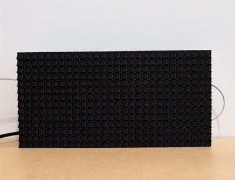

# flipdot-clock

A small application for displaying text or the time on an [Alfa-Zeta XY5 14*28 Flip-Dot display](https://flipdots.com/en/products-services/flip-dot-boards-xy5/).



## Features

- Display scrolling text, optionally in a loop
- Show current time [as a clock](img/clock.jpg)
- Large and small fonts
- Configurable text scroll speed
- A terminal output mode for testing loc

## Command Line Options

- `-clock` - Run the clock
- `-debug` - Enable debug logging
- `-serial-baud`- The baud rate for the serial connection. (default 57600)
- `-serial-port` - The serial port connected to the displays (default "/dev/ttyS0")
- `-terminal` - Display output to terminal instead of serial port.
- `-test-pattern` - Display a test pattern and then exit
- `-text` - Display some text
- `-text-loop` - Loop text continuously
- `-text-scroll-speed` - Text scroll speed. 1 is slow, 9 is fast (default 5)
- `-text-size` - Size of each character. Value must be one of 'large' or 'small'

## Install

To download a binary, check [the releases](https://github.com/FutureSharks/flipdot-clock/releases) or install manually:

```bash
go install github.com/FutureSharks/flipdot-clock@latest
cd $GOPATH/pkg/mod/github.com/FutureSharks/flipdot-clock*/
go run main.go
```

## Contributing

Contributions are welcome.

Initial inspiration taken from [github.com/chrishemmings/flipPyDot](https://github.com/chrishemmings/flipPyDot), so thanks to them.

To run tests:

```bash
# Run tests with verbose output
go test -v ./...

# Run specific test
go test -v -run TestDisplayShowTime ./flipdot/
```
